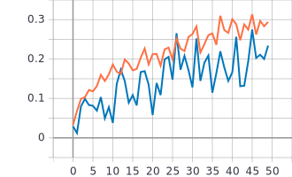
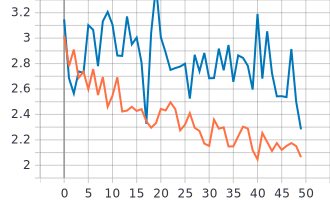

# Описание архитектуры нейронной сети
В данной лабораторной работе обучалась сверточная нейронная сеть для решения задачи классификации изображений дикой природы Oregon wildlife. Данный датасет Oregon_wildlife включает в себя около 12.000 картинок дикой природы, которые распределены на 20 различных категорий. Для обучения нашей нейронной сети использовалось 50 эпох, т.е. весь наш датасет пройдет через нейронную сеть 50 раз. Каждую эпоху разделены на части (батчи) размером 512 объектов в каждом батче. 
* Размерность входного изображения (224x224x3): 
```
inputs = tf.keras.Input(shape=(RESIZE_TO, RESIZE_TO, 3))
```
***
* Сверточные слои добавлены к нашей нейронной сети с использованием следующей функции Conv2D:  
```
x = tf.keras.layers.Conv2D(filters=8, kernel_size=3)(inputs)
```
Всего в одном сверточном слое у нас 8 фильтров, каждый фильтр будет применяться к изображению. Размерность матрицы ядра состовляет 3x3.  
Благодаря ядру постепенно “скользим” по нашему изображению  и выполняется операция свертки, а именно, поэлементно умножаются элементы нашего изображения на соответствующие элементы матрицы ядра и затем все эти произведения суммируем между собой. Далее с определенным шагом (по умолчанию шаг = 1) мы переходим к следующей части нашего изображения. Таким образом, наше ядро будет перемещаться по всему изображению с определенным шагом. Соответственно на выходе получаем некоторую выходную матрицу с элементами, которые получились в результате свертки. На выходе уменьшиться размерность изображения (она станет 222x222x8, так как в картинку размером 224x224 поместятся только 222x222 окон свертки размером 3x3). Формула изменения размера изображения:
```
[(W-K+2P)/S]+1
W - размер входного изображения
K - размер матрицы ядра
P - если есть padding, то 1, если нету, то 0
S - шаг 
```
*** 
* После получения свернутого изображения производится операция подвыборки (Max-Pooling):  
```
x = tf.keras.layers.MaxPool2D()(x)
```
Данная операция позволяет сгруппировать пиксели изображения и уплотнить их, т.е. уменьшить размер матрицы признаков (на выходе получим тензор размеров 111x111x8). Она сгруппирует пиксели в участке определенного размера (по умолчанию матрца ядра пулинга = 2x2) и выберет элемент с наибольшим значением, а далее перейдет к следующему участку с определенным шагом (по умолчанию 2), поэтому мы сожмем изображение.
***
* Flatten слой, позволяющий преобразовать наш многомерный тензор в одномерный (1D). На выходе получим одномерный массив размеров 111x111x8 = 98568
```
x = tf.keras.layers.Flatten()(x)
```
***
* Полносвязный Dense слой (выходной слой)
```
outputs = tf.keras.layers.Dense(NUM_CLASSES, activation=tf.keras.activations.softmax)(x)
```
Здесь и определяется к какому классу (категории) из 20 возможных будет относится поданное на вход изображение, а именно функция активации softmax даст определенную вероятность того, что поданное на вход изображение относится к определенному классу (из 20 возможных).
***
### После обучения данной нейронной сети получили следующие графики:
Синяя линия - на валидации  
Оранжевая линия - на обучении  
* График метрики точности для сверточной нейронной сети с одним сверточных слоем:


* График функции потерь для сверточной нейронной сети с одним сверточных слоем:


* Анализ полученных результатов  
Исходя из графиков мы можем заметить, что с каждой эпохой значение потерь сначала уменьшается, но затем величина ошибки начинает увеличиваться как на валидационном наборе так и на тренировочном наборе данных. К концу обучения мы можем заметить, что величина ошибки очень высокая. Причиной может являться то, что нашего датасета из 12000 картинок возможно не хватает для начальных случайных приближений.
***
## Создать и обучить сверточную нейронную сеть произвольной архитектуры с количеством сверточных слоев >3.
* Для решения этой задачи изменилось количество сверточных слоев, а именно, увеличили количество сверточных слоев Conv2D и увеличили количество слоев подвыборки MaxPool2D. Всего получили 5 сверточных слоев и 4 слоя подвыборки.
 * Причем у всех сверточных слоев изменили такие параметры как размер матрицы ядра (стал 5x5), а также у первых двух и последнего сверточного слоя добавили padding (padding = 'same') для того, чтобы входное изображение дополнялось крайними нулевыми значениями, и таким образом, когда ядро будет проходить по нашему изображению на выходе мы получим матрицу таких же размеров что и на входе (размерность не будет уменьшаться), однако так как у нас матрица ядра размером 5x5, то размерность все-таки уменьшится. 
 * У последнего сверточного слоя увеличили шаг: по умолчанию шаг = 1, стал равен 2 (strides = 2). Таким образом увеличив шаг с которым наша матрица ядра будет проходить по изображению по вертикали и по горизонтали, мы уменьшим размерность нашего изображения на выходе.
 * Все слои подвыборки MaxPool2D остались в значениях по умолчанию (размер ядра пулинга = 2x2, шаг пулинга = 2, padding отсутствует)
```
inputs = tf.keras.Input(shape=(RESIZE_TO, RESIZE_TO, 3)) # 224x224x3  
  x = tf.keras.layers.Conv2D(filters=8, kernel_size=5, padding = 'same')(inputs) # 222x222x8  
  x = tf.keras.layers.MaxPool2D()(x) # 111x111x8  
  x = tf.keras.layers.Conv2D(filters=8, kernel_size=5, padding = 'same')(x) # 109x109x8  
  x = tf.keras.layers.MaxPool2D()(x) # 55x55x8  
  x = tf.keras.layers.Conv2D(filters=8, kernel_size=5)(x) # 51x51x8  
  x = tf.keras.layers.MaxPool2D()(x) # 26x26x8  
  x = tf.keras.layers.Conv2D(filters=8, kernel_size=5)(x) # 22x22x8  
  x = tf.keras.layers.MaxPool2D()(x) # 11x11x8  
  x = tf.keras.layers.Conv2D(filters=8, kernel_size=5, strides = 2, padding = 'same')(x) # 5x5x8  
  x = tf.keras.layers.Flatten()(x) # 200
  outputs = tf.keras.layers.Dense(NUM_CLASSES, activation=tf.keras.activations.softmax)(x)  
```

### После обучения данной нейронной сети получили следующие графики:
Синяя линия - на валидации  
Оранжевая линия - на обучении 
* График метрики точности для сверточной нейронной сети с 5 сверточными слоями:


* График функции потерь для сверточной нейронной сети с 5 сверточными слоями:



* Анализ полученных результатов  
Исходя из графиков можно заметить, что наблюдается следующее: значение функции потерь на валидационном наборе данных начинает возрастать, в то время как значение функции потерь на тренировочном наборе данных продолжает снижаться и в конце наблюдается, что величина ошибки на валидационном наборе выше чем на тренировочном, а это означает, что наша сеть переобучилась и потеряла способность обобщать. Более того, из графика точности наблюдается, что значение точности у сверточной нейронной сети с одним слоем выше, чем у сверточной нейронной сети с 5 сверточными слоями (точность в первом случае достигает около 80 процентов на валидационном наборе данных, а во втором случае точность на валидационном наборе даже не достигает 30 процентов)
